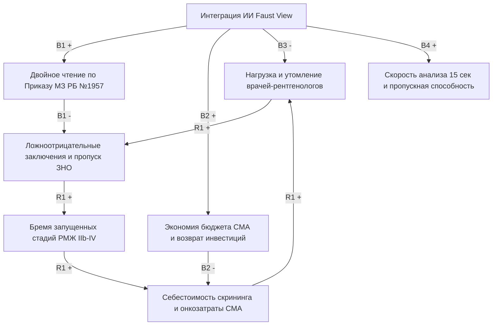

# 🎀 Диагностика рака молочной железы (РМЖ): Системно-динамическая модель (CLD) и экономический анализ

> **Интерактивная причинно-следственная диаграмма (Causal Loop Diagram — CLD), системные архетипы, симуляция и анализ минимизации затрат (CMA) для ИИ-маммографического скрининга**  
> На основе клинико-экономической валидации программно-аппаратного комплекса ИИ «Faust View» (*Гомельский государственный медицинский университет, Беларусь*).

[](LICENSE)
[](https://vitejs.dev/)
[](https://doi.org/10.29235/1818-9857-2025-3-76-83)

---

## 📌 Научная основа и первоисточник

Данный репозиторий содержит интерактивную модель системной динамики, каузального анализа контуров обратной связи и динамической симуляции клинического исследования:

> **Лось Д., Шаршакова Т.**  
> *Применение искусственного интеллекта в диагностике рака молочной железы*  
> **«Наука и инновации»**, 2025, № 3 (265), с. 76–83.  
> **DOI:** [10.29235/1818-9857-2025-3-76-83](https://doi.org/10.29235/1818-9857-2025-3-76-83)  
> *Учреждение образования «Гомельский государственный медицинский университет» (ГомГМУ)*

### Характеристика клинической выборки
- **Когорта:** 1 147 цифровых скрининговых маммограмм (**2 294 случая молочных желез**, оцененных в стандартных краниокаудальной CC и медиолатеральной косой MLO проекциях), полученных в ходе диспансеризации взрослого женского населения Гомеля и Гомельской области (октябрь–декабрь 2024 г.).
- **Оборудование:** Цифровые полноформатные рентгеновские маммографы «Маммоскан» (*ЗАО «АДАНИ» / Linev Systems*, Беларусь).
- **Программный комплекс:** Отечественный программно-аппаратный комплекс ИИ на базе компьютерного зрения «Faust View» (*ООО «Элитсофт», г. Минск*, Беларусь).
- **Протокол исследования:** Независимое слепое трехстороннее сопоставление:
  1. Врач-рентгенолог со стажем работы по специальности менее 5 лет (без узкой субспециализации).
  2. Алгоритм искусственного интеллекта «Faust View».
  3. Врач-эксперт маммолог со стажем работы более 10 лет (референсный «золотой стандарт»).
- **Нормативная база:** Полное соответствие приказу Министерства здравоохранения Республики Беларусь № 1957 (регламент обязательного независимого двойного чтения с категоризацией по шкале BI-RADS и арбитражным пересмотром расхождений).

---

## 📊 Доказанные клинико-экономические результаты

| Показатель / Метрика | Врач-рентгенолог (стаж < 5 лет) | ИИ-комплекс «Faust View» | Клинический и экономический эффект |
| :--- | :---: | :---: | :--- |
| **Чувствительность ($Se$)** | $71\% - 82\%$ | **$86\% - 89\%$** | Радикальное сокращение ложноотрицательных пропусков опухолей |
| **Специфичность ($Sp$)** | $100\%$ | **$100\%$** | Отсутствие ложноположительной гипердиагностики |
| **AUC ROC (Бинарные шкалы BI-RADS)** | $0.86 - 0.91$ | **$0.93 - 0.95$** | Статистически подтвержденная высокая дискриминация (One-vs-Rest) |
| **Время анализа одного случая** | $\approx 20\text{ минут}$ | **$\approx 15\text{ секунд}$** | **В $80$ раз быстрее**, снятие зрительного и когнитивного утомления |
| **Себестоимость исследования (CMA)** | $23.3886\text{ руб.}$ | **$11.6943\text{ руб.}$** | **Снижение затрат ровно в 2 раза** (чистая экономия $11.6943\text{ руб.}$/пациент) |
| **3-летний региональный эффект ($Э$)** | Базовый уровень | **$+573\,875.75\text{ руб.}$** | Расчет на когорту 44 793 женщин (методика ГКНТ № 30) |
| **Срок окупаемости затрат ($Р_{ин}$)** | — | **$1.74\text{ года}$** | Затраты на разработку и внедрение: $997\,592.59\text{ руб.}$ |

---

## 🔄 Системно-динамическая архитектура и контуры обратной связи



### Ключевые петли обратной связи (Feedback Loops)
1. **$R_1$ — Порочный круг дефицита кадров и выгорания (Workload Burnout Loop, усиливающий):**  
   Кадровый голод в регионах $\to$ когнитивная и зрительная перегрузка рентгенологов $\to$ пропуск мелких скоплений микрокальцинатов и архитектурных асимметрий $\to$ переход опухолей в запущенные стадии (IIb–IV) $\to$ взрывной рост затрат стационара на дорогостоящие таргетные химиопрепараты и инвалидизацию $\to$ истощение бюджета первичного звена.
2. **$B_1$ — Контур двойного чтения с ИИ (Balancing, балансирующий):**  
   Подключение ИИ «Faust View» как независимого второго читателя $\to$ 100% выполнение Приказа МЗ РБ № 1957 без расширения дефицитного штата $\to$ подавление ложноотрицательных заключений $\to$ раннее выявление преинвазивных карцином (in situ).
3. **$B_2$ — Фармакоэкономический контур оптимизации CMA (Balancing, балансирующий):**  
   Замена второго врача алгоритмом ИИ сокращает себестоимость ММГ ровно в 2 раза (с 23.39 до 11.69 руб.) $\to$ экономия 573 875.75 руб. за 3 года $\to$ полная окупаемость внедрения за 1.74 года.
4. **$B_3$ — Контур параллельного ассистирования и когнитивной разгрузки (Balancing):**  
   Анализ за 15 секунд с цветовой DICOM-разметкой подозрительных участков $\to$ снижение утомляемости врача $\to$ рост чувствительности молодых специалистов с 71–82% до 86–89%.

---

## 💻 Технологический стек приложения

- **Фронтенд:** React 18, TypeScript, Vite, Tailwind CSS
- **Интерактивная визуализация:** Векторный SVG-холст каузальной диаграммы (Causal Canvas) с масштабированием, динамической кривизной связей, анимацией импульсов потоков и индикацией полярности
- **Движок симуляции:** Численное интегрирование Рунге-Кутты (траектория 60 шагов с настройкой интервенций в реальном времени)
- **Аналитика:** Академический вьюер научной статьи с 7 интерактивными таблицами из публикации и 15 библиографическими источниками
- **Экспорт:** Экспорт графа в JSON Schema, научный отчет в Markdown (.md) и готовый макет для печати в PDF

---

## 🚀 Быстрый старт и локальный запуск

### Требования к окружению
- Node.js версии 18+ (рекомендуется Node 20 LTS)
- Пакетный менеджер npm или bun

### Установка и запуск

```bash
# Клонирование репозитория
git clone https://github.com/ai2medica/Breast-cancer-diagnosis-CLD.git

# Переход в каталог проекта
cd Breast-cancer-diagnosis-CLD

# Установка зависимостей
npm install

# Запуск локального сервера разработки
npm run dev
```

После запуска откройте в браузере адрес [http://localhost:3000](http://localhost:3000).

### Сборка production-версии

```bash
npm run build
```
Скомпилированное и оптимизированное веб-приложение будет сгенерировано в директории `./dist`.

---

## 🌐 Публикация и деплой на GitHub

Проект полностью настроен для публикации в ваш GitHub-аккаунт под именем **`Breast-cancer-diagnosis-CLD`**:

### Вариант 1. Через веб-интерфейс Google AI Studio (в 1 клик)
1. В правом верхнем углу панели нажмите кнопку **GitHub**.
2. Если привязан старый репозиторий, нажмите иконку **разорванной цепочки** (отвязать).
3. Создайте новый репозиторий с именем `Breast-cancer-diagnosis-CLD`.
4. Нажмите **«Push changes to GitHub»**.

### Вариант 2. Через Git-терминал
```bash
# 1. Добавить удаленный репозиторий (замените логин при необходимости)
git remote add origin https://github.com/ai2medica/Breast-cancer-diagnosis-CLD.git

# 2. Установить ветку main
git branch -M main

# 3. Отправить проект на GitHub
git push -u origin main
```

---

## 📖 Библиографическая ссылка (Citation)

При использовании данной системно-динамической модели или данных клинико-экономического анализа в научных работах используйте следующую ссылку:

```bibtex
@article{los2025breastcancer,
  title={Применение искусственного интеллекта в диагностике рака молочной железы},
  author={Лось, Дмитрий and Шаршакова, Тамара},
  journal={Наука и инновации},
  volume={265},
  number={3},
  pages={76--83},
  year={2025},
  doi={10.29235/1818-9857-2025-3-76-83},
  publisher={Белорусская наука}
}
```

---

## 📄 Лицензия

MIT License © 2025 AI2Medica и авторы клинического исследования (ГомГМУ).
