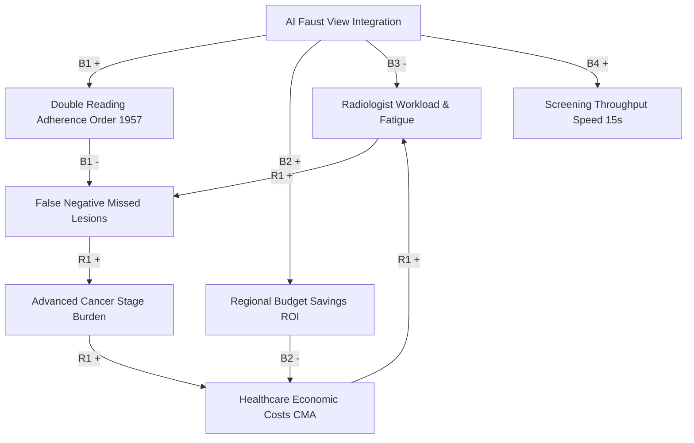

# 🎀 Breast Cancer Diagnosis CLD

> **Causal Loop Diagram (CLD), System Archetypes & Cost-Minimization Analysis (CMA) for AI-Powered Mammography Screening**  
> Based on clinical-economic validation of the «Faust View» AI software complex (*Gomel State Medical University, Belarus*).

[](LICENSE)
[](https://vitejs.dev/)
[](https://doi.org/10.29235/1818-9857-2025-3-76-83)

---

## 📌 Scientific Background & Reference

This repository implements an interactive causal loop diagramming, feedback loop analysis, and dynamic simulation model for the clinical research paper:

> **Лось Д., Шаршакова Т.**  
> *Применение искусственного интеллекта в диагностике рака молочной железы*  
> **«Наука и инновации»**, 2025, № 3 (265), с. 76–83.  
> **DOI:** [10.29235/1818-9857-2025-3-76-83](https://doi.org/10.29235/1818-9857-2025-3-76-83)  
> *Гомельский государственный медицинский университет (ГомГМУ)*

### Study Summary
- **Cohort:** 1,147 digital screening mammograms (**2,294 breasts** evaluated in CC and MLO standard projections) obtained during adult population health checkups (dispensary screening) in Gomel and the Gomel Region (October–December 2024).
- **Hardware:** Digital full-field mammography systems «Mammoscan» (*ADANI / Linev Systems*, Belarus).
- **Software:** AI-based Computer Vision Diagnostic Suite «Faust View» (*Elitsoft*, Belarus).
- **Protocol:** Blind triple-comparison:
  1. Primary radiologist (< 5 years experience, non-subspecialized).
  2. Independent AI algorithm «Faust View».
  3. Expert mammologist (> 10 years experience, reference "gold standard").
- **Regulatory Framework:** Compliance with Republic of Belarus Ministry of Health Order No. 1957 (mandating independent double reading with BI-RADS categorization and arbitration review for discordant cases).

---

## 📊 Key Proven Research Findings

| Metric | Radiologist (< 5 yrs) | AI Complex «Faust View» | Clinical / Economic Benefit |
| :--- | :---: | :---: | :--- |
| **Sensitivity ($Se$)** | $71\% - 82\%$ | **$86\% - 89\%$** | Substantial reduction in false-negative missed cancers |
| **Specificity ($Sp$)** | $100\%$ | **$100\%$** | Zero false-positive diagnostic inflation |
| **AUC ROC (Binary Scales)** | $0.86 - 0.91$ | **$0.93 - 0.95$** | Statistically verified discrimination (One-vs-Rest) |
| **Decision Time per Case** | $\approx 20\text{ min}$ | **$\approx 15\text{ seconds}$** | **$80\times$ faster**, eliminates cognitive fatigue |
| **Cost per Exam (CMA)** | $23.3886\text{ BYN}$ | **$11.6943\text{ BYN}$** | **$50\%$ cost reduction** (saves $11.6943\text{ BYN}$/patient) |
| **3-Year Regional Benefit ($Э$)** | Baseline | **$+573,875.75\text{ BYN}$** | Cohort of 44,793 women (State Standard SCST №30) |
| **Payback Period ($P_{in}$)** | — | **$1.74\text{ years}$** | Total development & deployment costs $997,592.59\text{ BYN}$ |

---

## 🔄 Causal Loops & System Dynamics Architecture



### Feedback Loops
1. **$R_1$ — Workload Burnout Loop (Reinforcing):**  
   Shortage of radiologists $\to$ cognitive overload and fatigue $\to$ missed microcalcifications and early pre-invasive lesions $\to$ manifestation of advanced-stage breast cancer (IIb–IV) $\to$ exponential growth of inpatient chemotherapy/surgical costs $\to$ budget depletion hindering outpatient hiring.
2. **$B_1$ — AI Double Reading Loop (Balancing):**  
   Integrating «Faust View» as a validated 2nd reader $\to$ 100% adherence to Order No. 1957 without hiring constraints $\to$ suppression of missed lesions $\to$ early detection $\to$ lower morbidity.
3. **$B_2$ — Cost Minimization Analysis (CMA) Loop (Balancing):**  
   Replacing the 2nd radiologist with AI cuts unit cost from 23.38 to 11.69 BYN $\to$ creates 573,875.75 BYN net savings over 3 years $\to$ full investment recovery in 1.74 years.
4. **$B_3$ — Parallel Cognitive Offloading (Balancing):**  
   15-second instant triage and visual DICOM risk overlay $\to$ relieves visual fatigue $\to$ elevates beginner doctor sensitivity to 86–89%.

---

## 💻 Tech Stack & Architecture

- **Frontend:** React 18, TypeScript, Vite, Tailwind CSS
- **Visualization:** Interactive SVG Causal Canvas with zoom/pan, dynamic edge curvatures, animated pulse flows, and polarities
- **Simulation Engine:** Runge-Kutta numerical integration (60-step dynamic trajectory with real-time parameter tweaking)
- **Analytics:** Full scientific paper viewer with interactive data tables (Tables 1–7) and 15 bibliographic references
- **Export:** Instant JSON Schema export, Academic Markdown export, and Print-to-PDF ready layout

---

## 🚀 Quick Start & Local Development

### Prerequisites
- Node.js 18+ (or Node 20 recommended)
- npm or bun

### Installation

```bash
# Clone the repository
git clone https://github.com/ai2medica/Breast-cancer-diagnosis-CLD.git

# Enter repository directory
cd Breast-cancer-diagnosis-CLD

# Install dependencies
npm install

# Start development server
npm run dev
```

Open [http://localhost:3000](http://localhost:3000) (or the port indicated in the terminal) in your browser.

### Production Build

```bash
npm run build
```
The production bundle will be generated in `./dist`.

---

## 🌐 Deploy to GitHub

To publish this project to your own GitHub account under the repository name **`Breast-cancer-diagnosis-CLD`**:

```bash
# 1. Initialize git (if not already initialized)
git init

# 2. Add files and commit
git add .
git commit -m "feat: initial commit for Breast cancer diagnosis CLD"

# 3. Rename branch to main
git branch -M main

# 4. Add your GitHub remote (replace <YOUR_GITHUB_USERNAME> with your username)
git remote add origin https://github.com/<YOUR_GITHUB_USERNAME>/Breast-cancer-diagnosis-CLD.git

# 5. Push to GitHub
git push -u origin main
```

### Automatic GitHub Pages Deployment
A pre-configured GitHub Actions workflow (`.github/workflows/deploy.yml`) is included.  
Once pushed:
1. Go to your repository **Settings** $\to$ **Pages**.
2. Under **Build and deployment** $\to$ **Source**, select **GitHub Actions**.
3. Your interactive web application will be live at `https://<YOUR_GITHUB_USERNAME>.github.io/Breast-cancer-diagnosis-CLD/`.

---

## 📖 Citation

If you use this model or findings in academic publications, please cite:

```bibtex
@article{los2025breastcancer,
  title={Применение искусственного интеллекта в диагностике рака молочной железы (Application of Artificial Intelligence in Breast Cancer Diagnosis)},
  author={Лось, Дмитрий and Шаршакова, Тамара},
  journal={Наука и инновации (Science and Innovations)},
  volume={265},
  number={3},
  pages={76--83},
  year={2025},
  doi={10.29235/1818-9857-2025-3-76-83},
  publisher={Белорусская наука}
}
```

---

## 📄 License

MIT License © 2025 AI2Medica & Gomel State Medical University Researchers.
